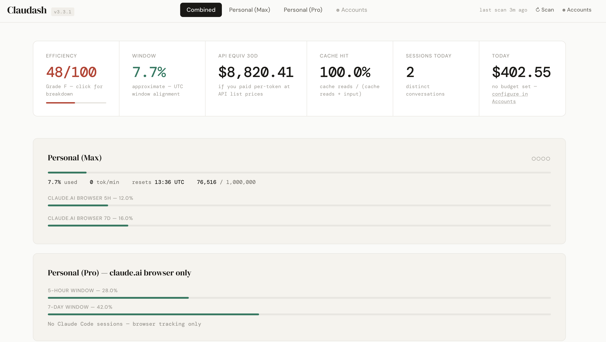

# Claudash

**Claude Code usage intelligence dashboard.**
Reads your local session files, detects waste patterns, generates fixes,
and measures whether they worked.



---

## What it does

Most Claude Code usage tools tell you how many tokens you spent.
Claudash tells you *why* and *what to do about it*.

It detects four waste patterns in your sessions — repeated file reads,
stuck retry loops, sessions that ran too long without compacting,
and cost outliers — then generates targeted CLAUDE.md rules to fix them
and measures the before/after difference.

---

## Prerequisites

Before installing Claudash, you need:

| Requirement | Why | How to check |
|---|---|---|
| Claude Code | Claudash reads its session files | `claude --version` |
| Python 3.8+ | Claudash is written in Python | `python3 --version` |
| Node.js 16+ | Required for npx install method only | `node --version` |

**Claude Code must have run at least one session** before Claudash
will show any data. Sessions are stored in:
- **macOS / Linux**: `~/.claude/projects/`
- **Windows**: `%APPDATA%\Claude\projects\`
- **WSL2**: `/mnt/c/Users/<username>/AppData/Roaming/Claude/projects/`

---

## Install

Choose the method that works for your setup:

### Method 1 — npx (fastest, no install needed)
```bash
npx @jeganwrites/claudash
```
Requires Node.js 16+. Downloads and runs without permanent installation.

### Method 2 — npm global install
```bash
npm install -g @jeganwrites/claudash
claudash dashboard
```
Installs permanently. Run `claudash` from anywhere.

### Method 3 — Homebrew (macOS / Linux)
```bash
brew tap pnjegan/claudash
brew install claudash
claudash dashboard
```
No Node.js required. Python only.

### Method 4 — Git clone (full control)
```bash
git clone https://github.com/pnjegan/claudash.git
cd claudash
python3 cli.py dashboard
```
No npm, no Node.js required. Best for development or customisation.

---

## Windows users

Claudash runs on Windows via **WSL2** (Windows Subsystem for Linux).
Native Windows support is in progress.

**Setup WSL2:**
```bash
# In PowerShell (as administrator)
wsl --install

# Restart, then open Ubuntu from Start menu
# Install Node.js inside WSL
curl -fsSL https://deb.nodesource.com/setup_20.x | sudo -E bash -
sudo apt-get install -y nodejs

# Install Claudash
npx @jeganwrites/claudash
```

Claudash will automatically detect your Windows Claude Code sessions
at `/mnt/c/Users/<username>/AppData/Roaming/Claude/projects/`.

---

## macOS users

**Quickest path:**
```bash
# Install Node.js if you don't have it
brew install node

# Run Claudash
npx @jeganwrites/claudash
```

Or use Homebrew install (no Node.js needed):
```bash
brew tap pnjegan/claudash
brew install claudash
claudash dashboard
```

---

## Linux users

```bash
# Ubuntu / Debian — install Node.js
curl -fsSL https://deb.nodesource.com/setup_20.x | sudo -E bash -
sudo apt-get install -y nodejs

# Run
npx @jeganwrites/claudash
```

---

## First run

```bash
# 1. Start the dashboard (auto-opens browser)
claudash dashboard

# 2. If no data appears, run the scanner manually
claudash scan

# 3. Check what's in your session files
claudash stats
```

Dashboard opens at **http://localhost:8080**

If the port is in use:
```bash
PORT=9090 claudash dashboard
```

---

## What you'll see

After your first scan:

- **Summary bar** — total sessions, total cost, cache hit rate
- **Project breakdown** — which projects cost the most
- **Efficiency score** — 0-100 grade across 5 dimensions
- **Active insights** — specific problems with fix suggestions
- **Waste events** — detected patterns with token cost
- **Fix tracker** — before/after measurement for applied fixes

A score below 50 is not unusual. The score measures how efficiently
you're using your context window, not whether the work was good.

---

## Backup and recovery

```bash
# Manual backup (creates snapshot + JSON export)
claudash backup

# Restore from backup
claudash restore --file ~/.claudash/backups/claudash-20260418.db

# Automated hourly backup (add to crontab)
0 * * * * cd /path/to/claudash && python3 cli.py backup --quiet
```

Your irreplaceable data is in the `fixes` and `fix_measurements` tables.
Everything else regenerates from your session files.

---

## Privacy and data handling

Claudash reads your Claude Code session files stored locally on your machine.

- **Nothing is uploaded** — all data stays in `data/usage.db` on your machine
- **No telemetry** — no usage tracking, no analytics, no external calls
- **No accounts** — no login, no email, no cloud sync
- **Session files contain your full conversation history** — Claudash reads them to extract token counts and tool calls only, not conversation content

The database is created with restricted file permissions (0600 on Unix systems).
API keys for fix generation are stored locally in the same database.

For team or cloud deployment, see [SECURITY.md](SECURITY.md).

---

## Troubleshooting

**Dashboard shows no data**
- Run `claudash scan` first
- Check that `~/.claude/projects/` contains `.jsonl` files
- On Windows, run inside WSL2

**Port 8080 already in use**
```bash
PORT=9090 claudash dashboard
```

**Python not found**
```bash
# macOS
brew install python@3.11

# Ubuntu
sudo apt install python3
```

**Node.js version too old**
Claudash requires Node.js 16+. Check with `node --version`.
Update via `brew upgrade node` (macOS) or via nvm.

**Permission denied on database**
```bash
chmod 600 data/usage.db
```

**WSL2 can't find Windows sessions**
Claudash looks for sessions in `/mnt/c/Users/<username>/AppData/Roaming/Claude/projects/`.
Confirm that path exists: `ls /mnt/c/Users/` and find your username.

---

## Contributing

Pull requests welcome. Especially:
- Windows native support (without WSL2)
- Firefox session key support for browser tracking
- Additional waste pattern detectors

```bash
git clone https://github.com/pnjegan/claudash.git
cd claudash
python3 cli.py dashboard  # no install needed
```

---

## License

MIT — use it, fork it, build on it.

---

*All data stays on your machine. Zero pip dependencies. One command install.*
